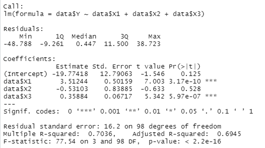
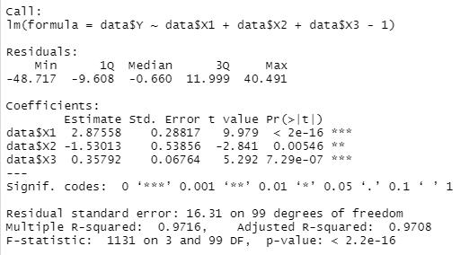
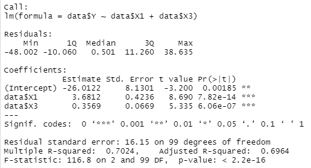

# Linear Regression Models

- **Description of the case study :**

Air pollution is currently one of the major public health concerns. Numerous studies have made it possible to highlight the influence on health of certain chemical compounds such as ozone (O3). 

The objective of this work is to model the value of ozone (O3) peaks as a function of physical quantities such as temperature and cloudiness.

For this purpose, we consider a dataset (see 'data.csv') containing 102 observations collected in Rennes during the summer of 2001:

The 4 variables observed are:

1) Y :  Maximum ozone concentration observed during the day (Y is the variable to be explained)
2) X1 : Observed temperature (explanatory variable)
3) X2 : Cloudiness observed (explanatory variable)
4) X3 : Maximum ozone content observed the day before (explanatory variable)

- **Regression with constant (Regression1) :**

- **Regression without constant (Regression2) :**

- **Choice of the most relevant model :**

To choose the model that best represents our data, we will base ourselves on several criteria and remarks.

1) Coefficients significance test : 

Knowing that generally α used in R is 5%. For the "regression1" model, the variable X2 does not satisfy the condition P-value ≤ α (because: 0.528> 0.05). That is, the variable X2 is not significant for this model. 

If we want to work with the model Y = a0 + a1.X1 + a3.X3 and eliminate X2 altogether, we will have an overall significance which is not better than the “regression1” model even if the individual significance of the variables will be good as the following capture indicates:

On the other hand, all the variables of the “regression2” model are significant (the P-values ≤ 0.05).

2) R-squared and adjusted R-squared test :

-the “regression1” model : R-squared = 0.7036, adjusted R-squared = 0.6945.

-the “regression2” model: R-squared = 0.9716, adjusted R-squared = 0.9708.

We therefore conclude that the "regression2" model is more significant than the "regression1" model, it allows us to explain more than 97% of the total variance of the data.

3) Other possible tests: The AIC and BIC :

-the “regression1” model: AIC = 863.4802, BIC = 876.6051.

-the “regression2” model: AIC = 861.8965, BIC = 872.3964.

the AIC and BIC indicators for the “regression2” model are slightly lower than those for the “regression1” model.

- **Conclusion :**

All the tests that we have done previously cite one model that seems to be more relevant to this study and that is the constant-free multiple linear regression model. This model is estimated: Y = 2.8.X1 - 1.5.X2 + 0.3X3, with standard deviation:

σ (a1) = 0.28, σ (a2) = 0.53, σ (a3) = 0.06